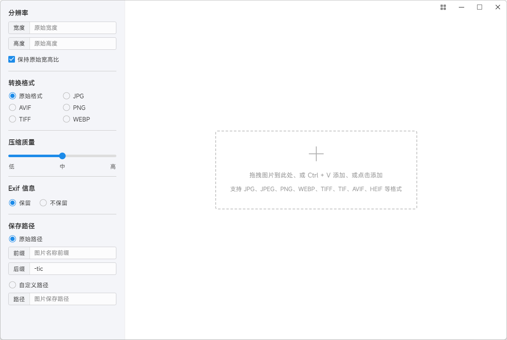
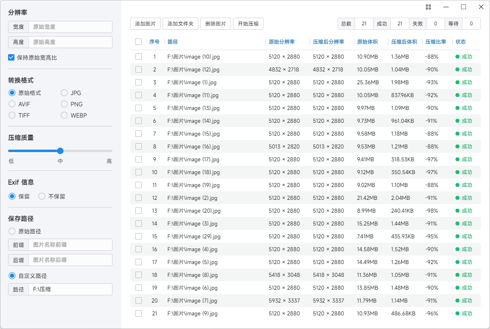

[中文](README.md) | [English](README.en.md)

# Topspeed Image Compressor
### An extremely fast image compression software

- [Features](#feature)
- [Download](#download)
- [Screenshot](#screenshot)
- [Explain](#explain)
- [Online](#online)

<h2 id="#feature">Features</h2>

- Ultra-fast compression speed
- Support compression of GB-level oversized images
- Support seven image formats
- Support adding images by drag, click, or ctrl+v
- Support adding folders
- Real-time display of current compression
- Support image preview
- Fully compressed locally, and will not upload images to ensure privacy and security.

<h2 id="#download">Download</h2>

- [Github download](https://github.com/Dreamer365/TopspeedImageCompressor/blob/main/TopspeedImageCompressor.exe)
- [Gitee download](https://gitee.com/dreamer365/topspeed-image-compressor/blob/master/TopspeedImageCompressor.exe)

<h2 id="#screenshot">Screenshot</h2>

<h2 id="#explain">Explain</h2>

The software is completely free to use, but the source code is not public. It is not allowed to be tampered with and sold. It is not allowed to be used for any commercial or illegal use. If you encounter problems during use or have any suggestions, you can submit an issue.

- [Github Issue](https://github.com/Dreamer365/topspeed-image-compressor/issues)
- [Gitee Issue](https://gitee.com/dreamer365/topspeed-image-compressor/issues)

<h2 id="#online">Online</h2>

For 'jpg' and 'png' formats, there is also an online page on the browser. Go and have a try!

- [Online](https://www.ticompressor.com/online/)
