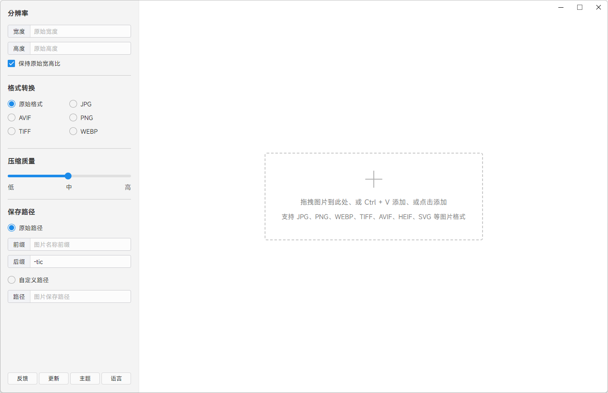
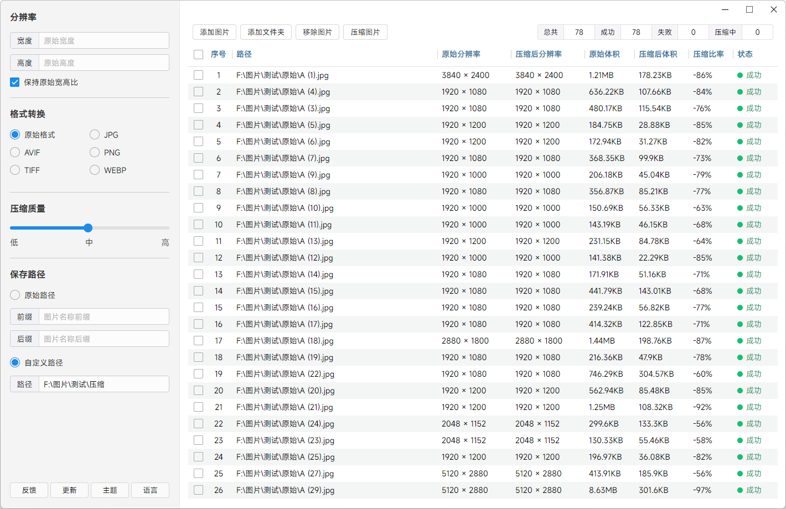

[中文](README.cn.md) | [English](README.md)

# 极速图片压缩器
### 一款速度极快的图片压缩软件

- [特点](#feature)
- [下载](#download)
- [软件截图](#screenshot)
- [使用说明](#explain)

<h2 id="#feature">特点</h2>

- 超快的压缩速度
- 支持压缩 `GB` 级别的超大图片
- 支持 `7` 种图片格式
- 支持图片预览
- 支持通过拖拽、点击、`ctrl + v` 等多种方式添加图片
- 支持添加文件夹
- 实时显示当前的压缩情况
- 完全在本地执行压缩，不会上传图片，保证隐私安全

<h2 id="#download">下载</h2>

- [Github 下载](https://github.com/Dreamer365/TopspeedImageCompressor/blob/main/TopspeedImageCompressor.exe)
- [Gitee 下载](https://gitee.com/dreamer365/topspeed-image-compressor/blob/master/TopspeedImageCompressor.exe)
    

<h2 id="#screenshot">软件截图</h2>

<h2 id="#explain">使用说明</h2>

软件完全免费使用，但不公开源码，不允许篡改和售卖，不允许用于任何商业用途和非法用途，使用过程中遇到问题或者有任何建议可以提交 issue：

- [Github Issue](https://github.com/Dreamer365/topspeed-image-compressor/issues)
- [Gitee Issue](https://gitee.com/dreamer365/topspeed-image-compressor/issues)
